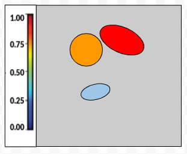

# NnUNetClient Example

This example demonstrates how to use the NnunetClient to train nnunet segmentation models in a federated setting.

By default this example trains an nnunet model on the Task04_Hippocampus dataset from the Medical Segmentation Decathlon (MSD). However, any of the MSD datasets can be used by specifying them with the msd_dataset_name flag for the client. To run this example first create a config file for the server. An example config has been provided in this directory. The required keys for the config are:

```yaml
# Parameters that describe the server
n_server_rounds: 1

# Parameters that describe the clients
n_clients: 1
local_epochs: 1 # Or local_steps, one or the other must be chosen

nnunet_config: 2d
```

The only additional parameter required by nnunet is nnunet_config which is one of the official nnunet configurations (2d, 3d_fullres, 3d_lowres, 3d_cascade_fullres)

One may also add the following optional keys to the config yaml file. If a nnunet plans file (which specifies model architecture and training hyperparameters) is not provided, the server will ask one of the clients to generate one using nnunet.

```yaml
# Optional config parameters
nnunet_plans: /Path/to/nnunet/plans.json
starting_checkpoint: /Path/to/starting/checkpoint.pth
```

To run a federated learning experiment with nnunet models, first ensure you are in the FL4Health directory and then start the nnunet server using the following command. To view a list of optional flags use the --help flag

```bash
python -m examples.nnunet_example.server --config_path examples/nnunet_example/config.yaml
```

Once the server has started, start the necessary number of clients specified by the n_clients key in the config file. Each client can be started by running the following command in a separate session. To view a list of optional flags use the --help flag.

```bash
python -m examples.nnunet_example.client --dataset_path examples/datasets/nnunet

# alternatively, with subclass of FlexibleClient
python -m examples.nnunet_example.client_flexible --dataset_path examples/datasets/nnunet
```

The MSD dataset will be downloaded and prepared automatically by the nnunet example script if it does not already exist. The dataset_path flag is used as more of a data working directory by the client. The client will create nnunet_raw, nnunet_preprocessed and nnunet_results sub directories if they do not already exist in the dataset_path folder. The dataset itself will be stored in a folder within nnunet_raw. Therefore when checking if the data already exists, the client will look for the following folder '{dataset_path}/nnunet_raw/{dataset_name}'

## Definitions

### Logits:

The outputs of a model <ins>prior</ins> to the activation function. Values are unconstrained (-inf, inf)

### Probabilities:

Probabilities are values constrained to the range (0, 1) that represent the models confidence of a pixel/voxel being part of a particular class. Similar to other DNN's, they do not necessarily represent actual probabilities, however it is sometimes convenient to interpret them as such. The predicted probabilities are the outputs of a model <ins>after</ins> a normalizing activation function such as softmax or sigmoid. A 2d example is shown below. In some instances one might have labels that are probabilities as opposed to integer class labels in which case we would refer to them as ground-truth probabilities.

### Detection Maps:

Images that contain an arbitrary number of distinct detected volumes generally derived from the predicted probabilities of a segmentation model. Values are constrained to range [0, 1]. Detected volumes are defined as:
- Each detected volume is a connected component that must be non-connected and non-overlapping (mutually exclusive) with other volumes of the same class. (Therefore detection maps for multiclass segmentation must be one hot encoded)
- Each pixel/voxel within a volume must have the same predicted probability. Therefore there is a single confidence/likelihood score for each volume.

Detected volumes typically also have a minimum size determined by the number of pixels/voxels that are a part of the volume. Detection maps may be computed from probabilities in a variety of ways. One example used for 3d medical images can be found in the [report guided annotation](https://github.com/DIAGNijmegen/Report-Guided-Annotation) API. An example of a 2d detection map is shown below.

### Segmentations:

Images in which pixels have been labelled or assigned one or more specific integer classes. If one hot encoded they must be binary {0, 1} or boolean {False, True} tensors. If not one hot encoded they must be be tensors containing only integers that represent the class labels (eg. constrained to {0, 1, 2, ..., N}). The labels/targets for segmentation models may be referred to as ground-truth segmentations. Predicted segmentations refers to model outputs (which are usually probability maps) that have been processed or thresholded in some way to adhere to the definition of a segmentation. They usually represents the model's final prediction of the class with no information on confidence. An example of a binary or one-hot-encoded predicted segmentation is shown below.

#### Examples of different output types in the case of 2d binary segmentation:


 | | |
:----------------------------:|:------------------------------:|:----------------------------------:
Probabilities | Detection Map | Segmentation|
